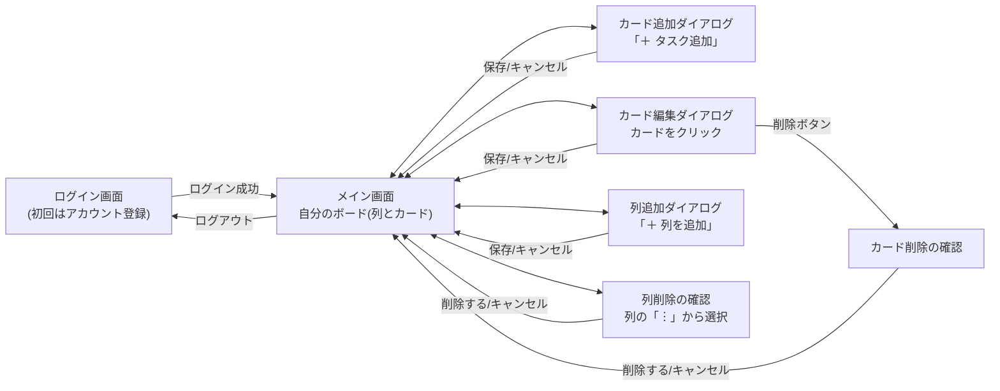
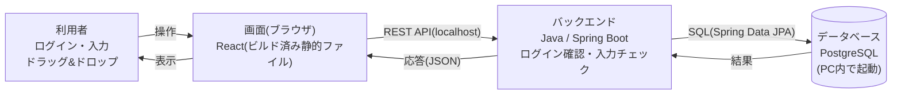
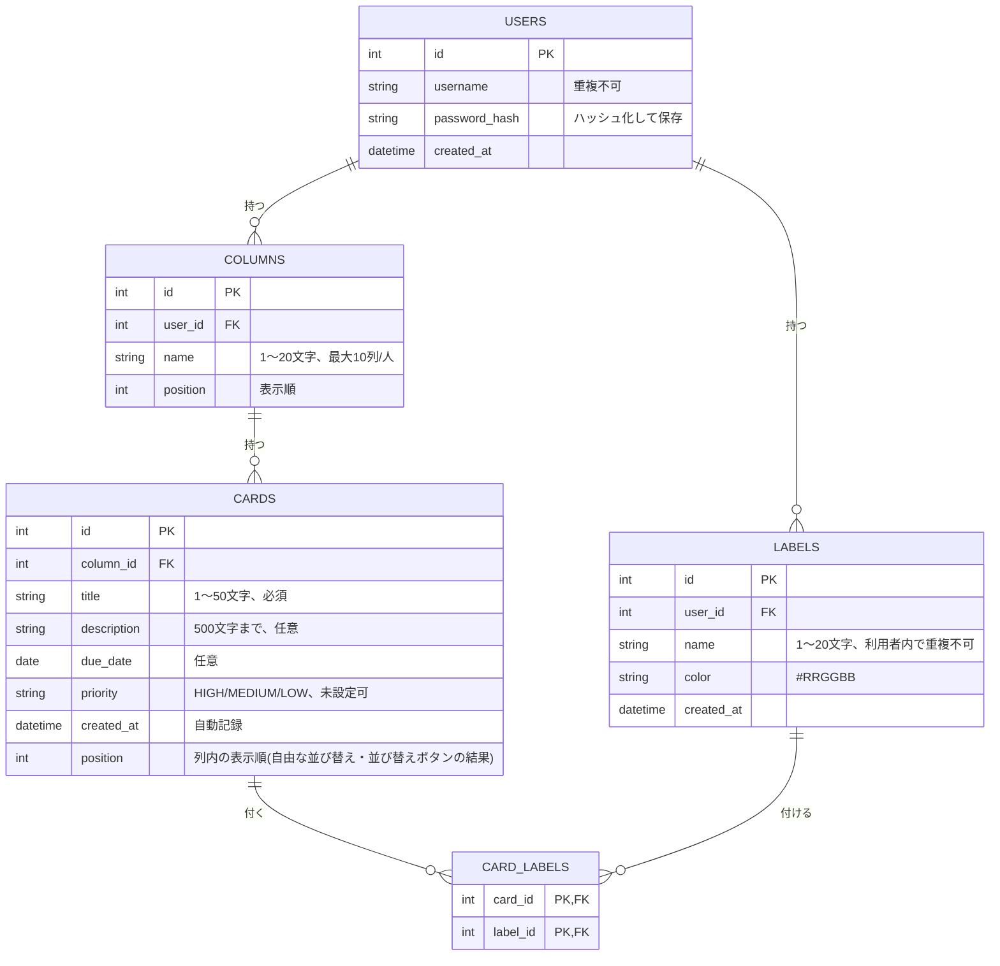

# タスク管理アプリ 遷移図・データフロー・ER図(DB版)

要件定義書([requirements.md](requirements.md) v3.4)の補足資料です。データはPC内のバックエンド(Java / Spring Boot)経由でデータベース(PostgreSQL)に保存します。
GitHub 上でこのファイルを開くと、以下の図がそのまま表示されます。

画面のモックアップ(見た目)は [screen-design.html](screen-design.html) を参照してください。

---

## 1. 画面遷移図

未ログイン時はログイン画面のみが表示されます。ログイン後にメイン画面(自分のボード)へ移り、追加・編集・削除の確認はダイアログとして重なって表示されます。

※ ドラッグ&ドロップによるカード移動は、メイン画面の中で完結する操作のため、画面遷移としては表現していません。

---

## 2. データの流れ

画面(ブラウザ)とデータベースの間に、PC内で動く「バックエンド(Spring Boot)」が入ります。インターネット通信はありません。

**処理の流れ**

1. **ログイン時**: バックエンド(Spring Security)がユーザー名・パスワードをDBと照合します。一致すればログイン成功とし、その利用者のデータのみを扱います。
2. **表示時**: バックエンドがログイン中の利用者の列・カードだけをDBから取得し、画面に渡します。
3. **操作時**: 追加・編集・削除・移動・並び替えのたびに、バックエンドが入力をチェックしてDBを更新します。
4. **表示更新**: 更新結果を画面(React)が受け取り、描き直します(期限切れの赤表示は、画面側でこのとき判定します)。

※ バックエンドは、そのPCの中だけで通信します(インターネットには接続しません)。

---

## 3. ER図(実装のDB設計)

要件定義書 7章のテーブル定義を図にしたものです。1人の利用者(users)が複数の列(columns)とラベル(labels)を持ち、1つの列が複数のカード(cards)を持ちます。カードとラベルは多対多で、card_labels で紐付けます。

| テーブル | 列名 | 制約(要件定義書 5章・7章より) |
|---|---|---|
| users | username | 必須。1〜50文字。重複不可(大文字・小文字は区別) |
| users | password_hash | 必須。平文では保存しない |
| columns | name | 1〜20文字。利用者ごとに最大10列 |
| columns | user_id | users.id への外部キー |
| cards | title | 1〜50文字、必須 |
| cards | description | 500文字まで、任意 |
| cards | due_date | 任意。未入力なら期限切れ判定なし |
| cards | priority | HIGH(重)/MEDIUM(中)/LOW(低)/未設定。カード上に色分けバッジで表示 |
| cards | column_id | columns.id への外部キー |
| labels | name | 1〜20文字。利用者ごとに重複不可 |
| labels | color | `#RRGGBB` 形式 |
| card_labels | card_id, label_id | 複合主キー。カードまたはラベルの削除で紐付けも削除 |
