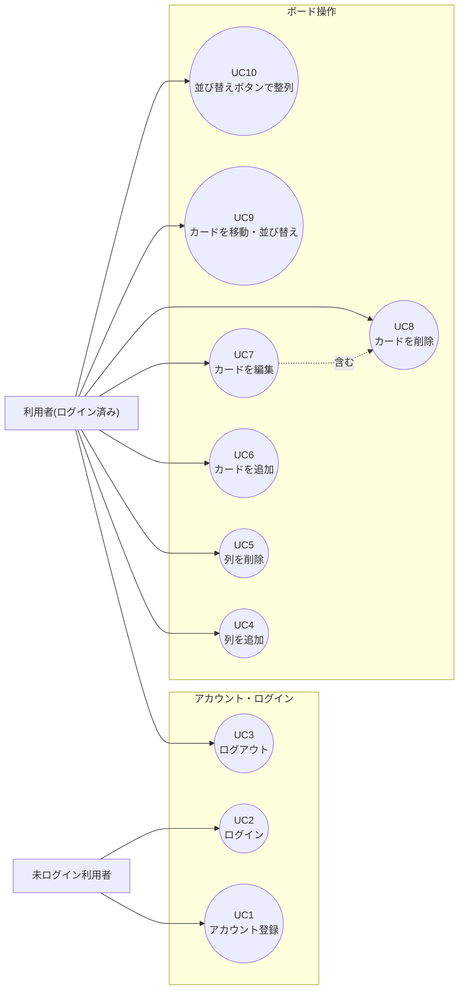

# タスク管理アプリ ユースケース

要件定義書([requirements.md](requirements.md) v2.1)の補足資料です。機能要件(5章)を、利用者の操作の視点で整理したものです。

## アクター

| アクター | 説明 |
|---|---|
| 未ログイン利用者 | アカウント登録・ログインのみ行える |
| 利用者(ログイン済み) | 自分のボード(列・カード)を操作できる |

Mermaid には UML のユースケース図が無いため、関係図(アクター→ユースケース)として表現しています。

※ UC7(カード編集)の画面からUC8(カード削除)を呼び出せるため、「含む」関係として表現しています(画面イメージ 4章参照)。

---

## ユースケース詳細

### UC1: アカウント登録

| 項目 | 内容 |
|---|---|
| アクター | 未ログイン利用者 |
| 事前条件 | アプリを起動し、ログイン画面が表示されている |
| トリガー | 「アカウント登録はこちら」を選ぶ |
| 基本フロー | 1. ユーザー名・パスワード・パスワード(確認)を入力する 2. 「登録する」を押す 3. システムがユーザー名の重複、パスワードの一致を確認する 4. 利用者を登録し、「未着手」「進行中」「完了」の3列を自動作成する 5. ログイン状態になり、メイン画面を表示する |
| 代替フロー | - ユーザー名が重複している場合、エラーを表示し、再入力を求める(3a) - パスワードと確認用が一致しない場合、エラーを表示する(3b) |
| 事後条件 | 利用者が登録され、専用のボードが作成される |
| 関連要件 | L-1, C-1 |

### UC2: ログイン

| 項目 | 内容 |
|---|---|
| アクター | 未ログイン利用者 |
| 事前条件 | アカウントが登録済み |
| トリガー | ユーザー名・パスワードを入力し「ログイン」を押す |
| 基本フロー | 1. ユーザー名・パスワードを入力する 2. システムが登録情報と照合する 3. 一致すればログイン状態になり、自分のボードを表示する |
| 代替フロー | - ユーザー名またはパスワードが誤っている場合、エラーを表示し、再入力を求める(2a) |
| 事後条件 | ログイン状態になり、自分の列・カードのみが表示される |
| 関連要件 | L-2, L-4 |

### UC3: ログアウト

| 項目 | 内容 |
|---|---|
| アクター | 利用者(ログイン済み) |
| 事前条件 | ログイン済み |
| トリガー | 画面上部の「ログアウト」を押す |
| 基本フロー | 1. 「ログアウト」を押す 2. ログイン状態を解除し、ログイン画面を表示する |
| 事後条件 | 再度ログインするまで、ボードは操作できない |
| 関連要件 | L-3 |

### UC4: 列を追加

| 項目 | 内容 |
|---|---|
| アクター | 利用者(ログイン済み) |
| 事前条件 | 自分の列数が10未満 |
| トリガー | 「＋ 列を追加」を押す |
| 基本フロー | 1. 列名(1〜20文字)を入力する 2. 「保存」を押す 3. 列がボードの末尾に追加される |
| 代替フロー | - 列名が未入力、または21文字以上の場合、エラーを表示する(1a) - 既に10列ある場合、追加できない旨を表示する(事前条件エラー) |
| 事後条件 | 新しい列が追加される |
| 関連要件 | C-2 |

### UC5: 列を削除

| 項目 | 内容 |
|---|---|
| アクター | 利用者(ログイン済み) |
| 事前条件 | 削除対象の列が存在する |
| トリガー | 列の「︙」メニューから「削除」を選ぶ |
| 基本フロー | 1. 列内にカードがある場合、「カードも一緒に削除されます」と確認を表示する 2. 「削除する」を押す 3. 列とその中のカードが削除される |
| 代替フロー | - 確認で「キャンセル」を選んだ場合、何も変更せずメイン画面に戻る(2a) |
| 事後条件 | 列と、列内の全カードが削除される(元に戻せない) |
| 関連要件 | C-3 |

### UC6: カードを追加

| 項目 | 内容 |
|---|---|
| アクター | 利用者(ログイン済み) |
| 事前条件 | 追加先の列が存在する |
| トリガー | 列の「＋ タスク追加」を押す |
| 基本フロー | 1. タイトル(必須)・詳細説明文(任意)・期限日(任意)を入力する 2. 「保存」を押す 3. システムが作成日時を自動記録する 4. カードが列の末尾に追加される |
| 代替フロー | - タイトルが未入力、または51文字以上の場合、エラーを表示する(1a) - 詳細説明文が501文字以上の場合、エラーを表示する(1b) |
| 事後条件 | カードが追加される。期限日が過去であれば、直ちに期限切れ表示になる |
| 関連要件 | T-1, D-1 |

### UC7: カードを編集

| 項目 | 内容 |
|---|---|
| アクター | 利用者(ログイン済み) |
| 事前条件 | 編集対象のカードが存在する |
| トリガー | カードをクリックする |
| 基本フロー | 1. タイトル・詳細説明文・期限日・重要度を変更する 2. 「保存」を押す 3. 変更内容が反映される(作成日時は変更不可) |
| 代替フロー | - 入力値が制約を満たさない場合、エラーを表示する(1a) - ダイアログ内の「削除」を押した場合、UC8(カードを削除)へ分岐する(1b) |
| 事後条件 | カードの内容が更新される |
| 関連要件 | T-2 |

### UC8: カードを削除

| 項目 | 内容 |
|---|---|
| アクター | 利用者(ログイン済み) |
| 事前条件 | 削除対象のカードが存在する |
| トリガー | カードの削除ボタン、またはUC7編集ダイアログ内の「削除」を押す |
| 基本フロー | 1. 削除確認を表示する 2. 「削除する」を押す 3. カードが削除される |
| 代替フロー | - 確認で「キャンセル」を選んだ場合、何も変更せずメイン画面(またはUC7)に戻る(2a) |
| 事後条件 | カードが削除される(元に戻せない) |
| 関連要件 | T-3 |

### UC9: カードを移動・並び替え

| 項目 | 内容 |
|---|---|
| アクター | 利用者(ログイン済み) |
| 事前条件 | 移動先・並び替え先の列が存在する |
| トリガー | カードをドラッグする |
| 基本フロー | 1. カードを掴む 2. 同じ列内の好きな位置、または別の列の好きな位置までドラッグする 3. ドロップすると、カードがその位置に入る |
| 代替フロー | - 列の外や無効な場所にドロップした場合、元の位置に戻る(3a) |
| 事後条件 | カードの位置(所属列・列内の順序)が変わる。「完了」列へ移動した場合、期限切れでも赤表示にならない(D-3)。別の利用者がUC10(並び替えボタン)を使うまで、この順序は保たれる |
| 関連要件 | T-4, D-3 |

### UC10: 並び替えボタンで整列

| 項目 | 内容 |
|---|---|
| アクター | 利用者(ログイン済み) |
| 事前条件 | 対象の列にカードが2件以上ある(1件以下の場合は押しても変化なし) |
| トリガー | 列の上部にある「優先度順」または「期限順」ボタンを押す |
| 基本フロー | 1. 「優先度順」を押す 2. その列のカードが、重要度「重→中→低→未設定」の順に並び替わる |
| 代替フロー | - 「期限順」を押した場合、期限が近い順に並び替える(期限未設定のカードは最後)(1a) |
| 事後条件 | 列内のカードの表示順が、選んだ基準で並び替わる。並び替え後も、UC9による自由なドラッグでの並び替えは引き続きできる(優先度・期限が同じカード同士は、並び替え前の順序を保つ) |
| 関連要件 | T-5 |

---

## 補足: システムが自動で行うこと(ユースケースに含めないもの)
以下は利用者の操作を伴わないため、ユースケースとしては記載していません(要件定義書 5.4章 D-2 を参照)。

- 画面を開いたとき・再読み込みしたときの、期限切れ判定と赤色表示
